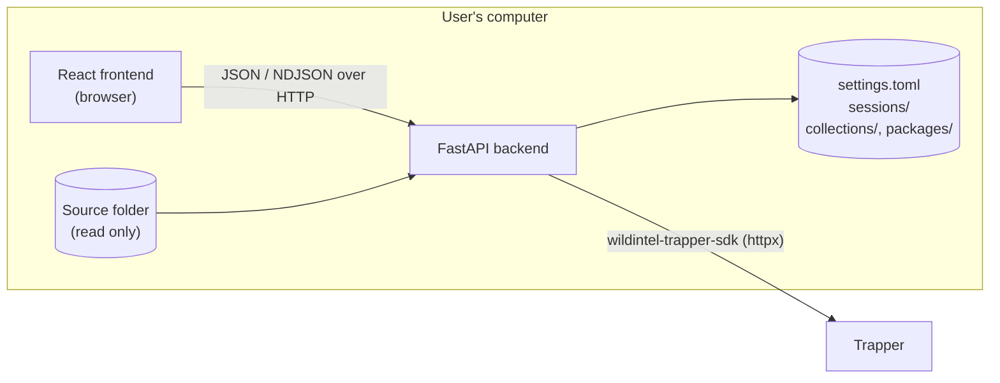

# WildINTEL Uploader — Developer Manual

---

## Table of Contents

1. [Architecture](#1-architecture)
2. [Development setup](#2-development-setup)
3. [Repository layout](#3-repository-layout)
4. [Backend](#4-backend)
5. [Frontend](#5-frontend)
6. [API reference](#6-api-reference)
7. [Adding a check](#7-adding-a-check)
8. [Testing](#8-testing)
9. [Building executables](#9-building-executables)
10. [Documentation](#10-documentation)
11. [CI/CD and releases](#11-cicd-and-releases)

---

## 1. Architecture

One Python package, `wildintel_uploader`, with a **core** and two faces on top of it:

- **web** — a **FastAPI** backend serving a **React** frontend, both on the user's own computer;
- **cli** — the `wildintel-uploader` command (**Typer** + rich), a smaller flow over the same core.

The core's services do the work and know nothing of either: long operations return **generators
of event dicts**, which the web routers stream to the browser as NDJSON and the command line
prints. Both use the same `settings.toml` and log. Released as a single executable (PyInstaller)
that runs the web app — starting the server and opening the browser — or, given any argument, the
command line.

It is a sibling of [wildintel-zooniverse](https://github.com/wildintelproject/wildintel-zooniverse)
and built the same way, so what you know of one carries over.



(The command line takes the backend's place in the diagram: it calls the same services
directly, in the same process, without HTTP.)

- **Local first.** The app's own data — the **collections folder** — is plain files and JSON
  (see the [user manual](user-manual-web.md#the-collections-folder)); there is no database. Trapper
  is only talked to when asked: looking things up, registering and uploading deployments, syncing.
  The source folder of an import is only ever *read*.
- **No server-side login session.** Every request carries the credentials it needs; blank ones
  fall back to the ones in `settings.toml`. Passwords never go back to the browser.
- **Long operations stream.** Imports, uploads and syncs answer with `application/x-ndjson`: one
  JSON event per line, as the work progresses, ending with `{"type": "done", …}` — or
  `{"type": "error", "detail": …}` if it fails midway (the HTTP 200 is already sent by then).
  Errors found before starting — bad paths, a research project that isn't there — are plain HTTP
  errors instead.
- **The wizard's progress is persisted** as JSON manifests on disk (see [Sessions](#sessions)),
  so an import can be resumed after closing the app.
- **What was checked is written down.** An import leaves `images.json`, `preprocessing.json` and
  `seal.json` beside the images — see [The deployment's files](#the-deployments-files).

Stack: Python ≥ 3.12, FastAPI, pydantic 2, Dynaconf, Typer, Pillow, ExifTool (external),
[wildintel-trapper-sdk](https://github.com/wildintelproject/wildintelproject-trapper-sdk);
React 19, TypeScript, Vite, Tailwind CSS 4, Vitest, oxlint.

## 2. Development setup

Requirements: [uv](https://docs.astral.sh/uv/), Node.js ≥ 18 (20 in CI), git, and
[ExifTool](https://exiftool.org/) (without it the camera id isn't read and the metadata step is
disabled; the tests that need it are skipped).

The Trapper SDK is used from a **sibling clone** while both are developed together
(`pyproject.toml`'s `[tool.uv.sources]`), so clone both side by side:

```bash
git clone https://github.com/wildintelproject/wildintel-uploader
cd wildintel-uploader
./setup.sh                                # see below
uv run wucli dev                          # backend :8769 + frontend :5176, hot reload
```

`setup.sh` checks git, installs uv if it's missing, clones the SDK next to the project
(`../wildintel-trapper-sdk`) if it isn't there, and installs the backend's (`uv sync`) and the
frontend's (`npm install`) dependencies. It can be run again at any time.

Open <http://localhost:5176>. The backend's own OpenAPI docs are at
<http://localhost:8769/docs>. In dev mode, edits in the SDK clone reload the backend too.

`uv run wildintel-uploader …` runs the user's command line — see the
[command-line manual](user-manual-cli.md). `wucli` (`src/wildintel_uploader/wucli.py`) is the
development one:

| Command | What it does |
|---|---|
| `uv run wucli dev` | Backend and frontend together, hot reload. |
| `uv run wucli backend serve [dev\|prod\|debug] [-p PORT]` | The backend alone. `debug` waits for a debugger (debugpy) on port 5678. |
| `uv run wucli backend test [-v] [-k …]` | Backend tests (pytest). |
| `uv run wucli frontend dev\|build\|preview\|test\|lint` | Frontend via npm (installing its dependencies first if needed). |
| `uv run wucli docs serve\|build` | This documentation (`build` is strict, as in CI). |
| `uv run wucli package build [-f FORMAT] [-v VERSION]` | This system's package into `dist/` — see [Building executables](#9-building-executables). |

!!! note "Why not `cli`"
    wildintel-trapper-sdk, installed in the same environment, already has a top-level `cli`
    module and `cli` command; a second one would shadow it — or be shadowed — depending on the
    install order. Hence `wucli`.

The backend port is `WILDINTEL_UPLOADER_WEB_PORT` (8769 — one above wildintel-zooniverse's, so
every WildINTEL app runs side by side); the log level `WILDINTEL_UPLOADER_WEB_LOG_LEVEL`, which
wins over the settings page's. Both can also go in `src/wildintel_uploader/web/.env` or
`~/.config/wildintel_uploader_web/.env` (see `web/settings.py`).

!!! note "Two kinds of settings"
    `web/settings.py` is the **server's** (port, log level, CORS — environment variables).
    `core/config.py` is the **app's** own `settings.toml` (Trapper account, the images folder,
    checks, preprocessing — the ⚙️ page, and `wildintel-uploader config`).

## 3. Repository layout

```text
wildintel-uploader/
├── src/wildintel_uploader/
│   ├── core/
│   │   ├── config.py            # the app's settings.toml (pydantic + Dynaconf), several configs
│   │   ├── logging_setup.py     # the log file and console
│   │   ├── parallel.py          # a bounded thread pool, for validating/preprocessing images
│   │   ├── version.py
│   │   ├── schemas/requests.py  # request models — DeploymentFields is Camtrap DP's deployments row
│   │   └── services/            # the actual work (see below)
│   ├── web/
│   │   ├── main.py              # FastAPI app: routers + the built frontend as static files
│   │   ├── app_entry.py         # executable entry point: the web app — or, with arguments, the CLI
│   │   ├── settings.py          # the server's settings (env vars / .env)
│   │   └── api/routers/         # one router per area — thin: resolve credentials, map errors, stream
│   ├── cli/
│   │   ├── app.py               # the Typer app: config, trapper lookups, import-deployment
│   │   └── common.py            # the console, credentials, errors
│   └── wucli.py                 # the development CLI (uv run wucli …)
├── tests/unit/                  # pytest — Trapper always faked
├── frontend/
│   └── src/
│       ├── api.ts               # every backend call, and the NDJSON stream reader
│       ├── types.ts             # the backend's models, in TypeScript
│       ├── pages/               # one per task, plus Settings, Menu, Welcome and Resume
│       ├── components/          # Combobox, OptionCards, pickers… shared by pages
│       ├── deploymentValidation.ts  # the details form's rules, mirroring DeploymentFields
│       └── test/                # Vitest setup and fixtures
├── tools/
│   ├── make_example_deployment.py   # a deployment of sample images, with camera EXIF
│   └── screenshots/         # the manual's screenshots: capture.py + mock_api.js
├── examples/                    # small folders of images for trying the wizard (see below)
├── docs/                        # this documentation (MkDocs Material)
├── .github/workflows/           # CI, docs, release
├── wildintel-uploader.spec      # PyInstaller
├── setup.sh                     # installs everything for development
├── mkdocs.yml
└── CHANGELOG.md
```

`examples/` holds folders to try each case with: a good deployment (`deployment_example`) and
ones with corrupted images, duplicates, missing EXIF, mixed cameras, subfolders and unordered
images; and sessions — `session_example`, and one with a `_FileTimestampLog.csv`
(`session_example_timestamp_log`).

For something bigger, `tools/make_example_deployment.py` makes a deployment of any number of images
(3000 by default, into `examples/deployment_example_3000/`, which git ignores): small and all
different, in bursts of three shots, numbered in the order they were taken, each with the camera's
make, model and serial number and its capture date in the EXIF — a Reconyx HyperFire 2,
`P800HG08`. It is what to try a long import, the statistical checks or an upload with.

## 4. Backend

### Services

`core/services/`, one module per concern:

| Module | Does |
|---|---|
| `deployment_import_service` | The wizard's backbone: scan a folder (EXIF dates, camera), the image **validations** and deployment **postvalidations**, the deployment id and revisions, copying, and the import streams. |
| `preprocessing_service` | Dates, rename, resize and XMP metadata; writes `preprocessing.json`. Drives the import. |
| `statistics_service` | The statistical postvalidation: sequences, and whether this revision is like the earlier ones of the location. |
| `report_service` | The reports: builds them from a validation's, a postvalidation's or a preprocessing's results, keeps them as JSON in `<data dir>/reports/`, lists, deletes and exports them to CSV. |
| `seal_service` | Runs the checks over the source images and writes/verifies `seal.json`. |
| `local_folder_service` | The collections folder: research projects, locations, collections, deployments, `images.json`, the timestamp log. |
| `camera_info` | The camera's model and id, through ExifTool when it's there (bundled or on the `PATH`), else Pillow. |
| `trapper_service` | Thin wrapper over the SDK for lookups; registers a deployment through the classic import form. |
| `trapper_upload_service` | Uploading a deployment: location, deployment, packing in zips + yaml, upload, wait. Also the access check. |
| `sync_service` | Fills the collections folder from a Trapper classification project. |
| `session_store` | The wizard's resumable runs. |
| `folder_picker`, `file_manager` | The OS's native folder dialog and file explorer — this is a local tool, so the backend can open them on the user's screen. |

### Threads

Validating and preprocessing images is CPU-bound (decoding, hashing, resizing), so it runs on a
pool of threads — `GENERAL.workers` of them, default the CPUs up to 4 (`core/parallel.py`).
Pillow and ExifTool, which is a subprocess, release the GIL for the heavy parts. Events are still
yielded in order, from the generator's own thread.

### Camera and ExifTool

The serial number of a camera trap lives in the maker's own MakerNotes, which only ExifTool
decodes across brands. `camera_info.exiftool_path()` finds the copy bundled with the executable
(`exiftool/` inside the PyInstaller bundle — the release workflow unpacks it into
`build/exiftool`), then the one on the `PATH`. Without it, Pillow gives the make and model, and the
result says which reader was used so the UI can say "may be incomplete". ExifTool also writes the
XMP metadata of the preprocessing, which is why that step is disabled without it.

### The import

`/api/deployment-import/import-local` calls `preprocessing_service.preprocess_stream` when the
request has preprocessing options (the wizard always sends them), or
`deployment_import_service.import_local_stream` (a plain copy) when it hasn't. It yields:

| Event | |
|---|---|
| `{"type": "copy", "index", "total", "name"}` | An image done. |
| `{"type": "metadata", "total"}` | Writing XMP. |
| `{"type": "skipped", "name", "detail"}` | An image that failed; the rest go on. |
| `{"type": "sealing"}` | Checking the source images and writing `seal.json`. |
| `{"type": "done", "dest_dir", "processed", "skipped", "sealed"}` | Finished. |

The wizard's import does **not** talk to Trapper: the deployment is registered when it is
**uploaded**. `/api/deployment-import/import` — copy, then register it through Trapper's classic
deployment form — is the command line's flow.

The **timezone** is read from the location, in the research project's `locations.json`
(`local_folder_service.location_time`), never from the request: `import-local` refuses a location
with none. This is deliberate — see the [user manual](user-manual-web.md#the-location-owns-the-timezone).

### Reports

`report_service` turns the results the checks already return into one JSON shape:

```json
{"id": "20261006-094512_validation_R0003-DONA_01", "kind": "validation", "title": "…", "created_at": "…",
 "source_dir": "…", "deployment_id": null, "parameters": {…}, "checked": 241,
 "checks": {"duplicates": {"label": "Duplicate images", "scope": "images", "ok": 239, "failed": 2}},
 "totals": {"entries": 965, "ok": 963, "failed": 2},
 "entries": [{"identifier": "IMG_0087.JPG", "check": "duplicates", "status": "failed", "message": "same content as …"}]}
```

An entry is one check of one image (its path in the source folder) or of the deployment (`"(deployment)"`); a check that
looks at every image has an entry for each, the passed ones too. `validation_report`, `postvalidation_report` and
`preprocessing_report` build it; `save` writes it atomically and returns its id (the file's name, which is all
`read` and `delete` accept — never a path).

They are made where the work is: `/deployment-import/validate-images` and `/validate-deployment` add `report_id` to
their answer, and the import's `done` event carries the preprocessing's. A report that can't be written is logged and
`report_id` is `null` — it never fails what it reports. The frontend's `ReportPanel` shows one (`api.getReport`) and links
to the downloads; `ReportsPage` lists them.

To report a new check, add its entries where the report is built (`report_service`) — see [Adding a check](#7-adding-a-check).

### The deployment's files

| File | Written by | Content |
|---|---|---|
| `deployment.json` | `local_folder_service.write_deployment_metadata` | A `DeploymentFields`. |
| `images.json` | `local_folder_service.write_images_file` | `{deployment_id, source, image_count, first, last, images: [{name, local_time, source, extra}]}`. `source` is `local` or `trapper`; `extra` holds what each source knows. `local_time` is the camera's wall clock — what the statistics read. |
| `preprocessing.json` | `preprocessing_service` | `{options, images: […]}`: per image its original name, name, capture date and where it came from, and `source_hash` / `hash` / `final_hash`. **Its presence is what "preprocessed" means** to the upload. |
| `seal.json` | `seal_service.seal` | Per image and for the deployment, which checks passed; `sha256` of the images and of `deployment.json`; `seal`, the hash of all of it. `seal_service.verify` recomputes and reports `valid`, `broken` (with what `changed`, is `missing`, was `added`) or `none`. |
| `upload.json` | `trapper_upload_service` | `{uploaded_at, research_project_pk, classification_project_pk, collection, …}`. |

A deployment whose `images.json` says `"source": "trapper"` was **synced**: its images were never
here, and it isn't modified (`local_folder_service.is_synced`).

### The upload

`trapper_upload_service.upload_stream` runs these steps, each a `{"type": "step", "step",
"status": running|done|skipped, "message"}` event: `connect` → `classification` → `location` →
`deployment` → `package` → `csv` → `upload` → `process` → `wait`, plus `upload_progress` while a
file goes up and a final `done`. Three modes:

- `upload` — all of it;
- `dry_run` — the same decisions, reading Trapper only (nothing created, sent or written);
- `generate` — only `package` and `csv`: the zips, yamls and `<collection>_deployments.csv`
  under `<data dir>/packages/<research project>/`. It needs no connection if the research project's
  pk in Trapper is known (`trapper_pk` in `research_project.json`).

Packing splits a deployment's images in zips of at most `max_zip_mb` (`split_by_size`; a bigger
file goes alone). The yaml names the **classification project's** pk — not the research
project's — the deployment in lower case, as Trapper keeps it, and the location's timezone and
summer-time setting, which Trapper checks against the location it has. Locations and deployments
are found ignoring case: Trapper keeps its ids in lower case, the collections folder in upper.

### Sync

`sync_service.sync_stream` reads Trapper only. Collections are those of the classification project
whose name starts with `R`; a deployment goes to the one its id starts with
(`R0003-DONA_01` → `R0003`); what the folder already has is kept; and the images aren't
downloaded, so `images.json` is built from the resources Trapper lists, in the location's
timezone. Deployments Trapper holds in a way that isn't a valid `DeploymentFields` are reported
in `failed`, not raised.

### Sessions

A **session** is one wizard run's own directory under `<Documents>/wildintel-uploader/sessions/<task_id>/`,
holding a `session.json`, in the phases `scanned` → `selected` → `ready`
(`services/session_store.py`). Each writer merges its own section into what is on disk, writes
atomically (`.tmp` then replace), and no phase erases another's. The session is offered back on
start-up until the import reaches `done`, which discards it. Credentials never reach this module.

### Logging

`core/logging_setup.py`: console and a rotating file (`logs/wildintel-uploader.log`, 5 MB × 5) at
`GENERAL.log_level`, changed on the fly when the settings are saved. At `DEBUG` each file and each
Trapper query is logged, and tracebacks are kept; the libraries' byte-level chatter stays at INFO.
The command line only prints warnings unless given `-v`.

### Streaming endpoints

Every router that streams does it the same way: the checks that can fail before starting are done
first, as plain HTTP errors (`HTTPException`), and then:

```python
def lines() -> Iterator[str]:
    try:
        for event in events:
            yield json.dumps(event) + "\n"
    except Exception as exc:
        yield json.dumps({"type": "error", "detail": describe(exc)}) + "\n"

return StreamingResponse(lines(), media_type="application/x-ndjson")
```

The request going away (closing the tab) stops the generator.

## 5. Frontend

React 19 + TypeScript + Vite + Tailwind 4, in `frontend/`. There is no router: `App.tsx` holds
the current task and shows one page.

| Page | |
|---|---|
| `WelcomePage`, `MenuPage` | The first screen and the task menu (`OptionCards`; a task with `available: false` is *coming soon*). |
| `ResumeSessionsPage` | The unfinished runs, shown before the menu when there are any. |
| `ImportDeploymentPage` | The seven-step wizard. The biggest file: its step components and the forms. |
| `ImportSessionPage` | The same steps for a folder of deployments. Reuses the wizard's pieces, exported from `ImportDeploymentPage`. |
| `UploadDeploymentPage` | Research project → collection → deployments → mode, and a card per deployment. |
| `SyncCollectionsPage` | Classification project → collection → deployments, and a live log. |
| `SettingsPage` | Shown *over* the rest, which stays mounted but hidden, so a run in progress isn't lost. |

- `api.ts` has every backend call. `streamNdjson` reads a streamed response line by line, calls
  back with each event, and turns an `{"type": "error"}` line into a rejection.
- `types.ts` mirrors the backend's models — keep them in step by hand.
- `deploymentValidation.ts` and `researchProjectValidation.ts` repeat the backend's rules so the
  forms can say what's wrong while you type; the backend validates again.
- The wizard's two lists of checks (`IMAGE_CHECK_OPTIONS`, `DEPLOYMENT_CHECK_OPTIONS`) drive the
  check tables, the settings page and what is sent.
- Dark mode is the Tailwind `dark` class on `<html>`, toggled by the navbar.
- The navbar's *Help* opens the documentation site (`DOCS_URL` in `Navbar.tsx`) — its default version.

Components are tested with Vitest and Testing Library (`*.test.tsx` beside them); `test/fixtures.ts`
has sample backend payloads.

## 6. API reference

The backend's own interactive docs are at `/docs` when it runs. All paths are under `/api` (the
routers' own prefixes are `/trapper`, `/deployment-import`, `/settings`, `/sessions`, `/upload` and
`/sync`; health is `/api/health` and `/api/version`); all
bodies are JSON, and every `POST` that talks to Trapper takes optional `url`, `username` and
`password` that default to the settings'.

| Router | Endpoint | Does |
|---|---|---|
| health | `GET /health` | Is the backend up. |
| | `GET /version`, `GET /version/check` | The version; and the latest release for this platform. |
| trapper | `GET /trapper/config` | URL and username saved (no password). |
| | `POST /trapper/test-connection` | Tests the credentials. |
| | `POST /trapper/research-projects`, `/classification-projects`, `/locations`, `/deployments` | Lookups. |
| settings | `GET`/`PUT /settings` | The active config. |
| | `GET`/`DELETE /settings/log` | Download / delete the log. |
| | `GET`/`POST /settings/configs`, `POST …/{id}/activate`, `GET …/{id}/download`, `POST …/{id}/open-folder` | Several settings files. |
| deployment-import | `POST /deployment-import/browse-folder` | The native folder dialog. |
| | `…/scan-folder`, `/scan-session` | Scan a deployment's / a session's folder. |
| | `…/validate-images`, `/validate-deployment` | The two sets of checks. |
| | `…/research-projects/list`, `/save`; `…/locations/list`, `/save`, `/update` | The collections folder's research projects and locations. |
| | `…/check-collection`, `/collection-path`, `/existing-deployments`, `/list-local-deployments` | What is already kept. |
| | `…/next-revision`, `/previous-deployments` | The revision to propose; the earlier deployment to fill the form from. |
| | `…/timestamp-log` | Add a deployment to the collection's timestamp log. |
| | `…/seal` | Whether a kept deployment still matches its seal. |
| | `…/exiftool` | Whether ExifTool is available. |
| | `…/import-local` | **Streams** the wizard's import. |
| | `…/import` | **Streams** copy-and-register (the command line's flow). |
| | `…/open-folder` | Open a folder in the file explorer. |
| reports | `GET /reports` | What each report says of itself, newest first. |
| | `GET /reports/{id}`, `DELETE /reports/{id}` | A report, with its entries; delete it. |
| | `GET /reports/{id}/download?format=json\|csv` | The report as a file. |
| sessions | `GET /sessions`; `POST /sessions/scan`, `/selection`, `/details`; `DELETE /sessions/{id}` | Resumable runs. |
| upload | `POST /upload/collections` | The collections kept for a research project, with their deployments. |
| | `…/classification-projects`, `/check-access` | For the page's pickers and *Test connection*. |
| | `…/deployment` | **Streams** one deployment's upload (any mode). |
| sync | `POST /sync/collection-names` | The classification project's collections starting with `R`. |
| | `…/collections` | **Streams** the sync. |

Errors: `HTTPException` with a plain `detail`. The SDK's exceptions are mapped
(`trapper.http_exc`): bad credentials → 401, forbidden → 403, not found → 404, connection or
timeout → 502/504. The command line has its own `describe()` with the same wording.

## 7. Adding a check

A check runs in three places — a service, the API and the UI — and has a setting. To add, say,
an image check `x`:

1. **The service.** In `deployment_import_service`, add `"x"` to `IMAGE_CHECKS` and its logic in
   `validate_images` (`DEPLOYMENT_CHECKS` and `validate_deployment_consistency` for a
   postvalidation; a statistical one goes in `statistics_service`'s `STATISTIC_CHECKS`). It returns its findings in the
   result, under its own key.
2. **The seal.** `seal_service.run_checks` turns the same results into what `seal.json` records for
   each image — add what `x` found there, or the seal will say `ok` for it.
3. **The API.** Add `"x"` to the `ImageCheck` literal in `schemas/requests.py` (or
   `DeploymentCheck`), so a request can ask for it.
4. **The setting.** Add `x: bool = True` to `ValidationSettings` (or `PostvalidationSettings`) in
   `core/config.py` — the switch in the settings page — and to the page's list.
5. **The UI.** Add it to `IMAGE_CHECK_OPTIONS` (or `DEPLOYMENT_CHECK_OPTIONS`), its type in
   `types.ts`, and render its findings in `ValidationReport` (or `DeploymentCheckReport`).
6. **The report.** Add its entries to the report of its phase in `report_service`, and its label to `LABELS`.
7. **Tests** — see below — and a line in the user manual's table of checks.

## 8. Testing

```bash
uv run wucli backend test              # pytest; -v, -k NAME
uv run wucli frontend test             # vitest (frontend/)
uv run wucli frontend lint
```

- **Backend** — `tests/unit/`: services directly and the routers through FastAPI's `TestClient`.
  **Trapper is always faked** — nothing needs a server or an account. Tests that need ExifTool are
  skipped without it (CI installs it). Image fixtures are generated into `tmp_path`; the folders
  in `examples/` are for trying the wizard by hand.
- **Frontend** — Vitest and Testing Library, a `.test.tsx` beside each page and component, with
  `api.ts` mocked.
- **Settings in tests** — `conftest.py` redirects `HOME` and the config and documents folders to a
  throwaway directory before anything is imported, so a test never reads or writes the developer's
  own `settings.toml` or collections.

## 9. Building executables

One executable per platform, with PyInstaller (`wildintel-uploader.spec`), containing the Python
runtime, the backend, the built frontend (as `static/`, served by `web/main.py`) and ExifTool.
PyInstaller doesn't cross-compile: each platform builds on its own runner.

```bash
uv run wucli package build              # this system's, into dist/
uv run wucli package build -f appimage -v 0.1.0
```

| Platform | Result |
|---|---|
| Linux | `wildintel-uploader-X.Y.Z-linux-x86_64.AppImage` (built on Ubuntu 22.04, an older glibc, so it runs on more distributions) |
| Windows | `wildintel-uploader-X.Y.Z-windows-x64.exe`, portable |
| macOS | `wildintel-uploader-X.Y.Z-macos-arm64.dmg`, Apple Silicon |

The command builds the frontend first. The version defaults to the git tag, or `0.0.0-dev` —
written into `src/wildintel_uploader/_version.py` (not committed), which `core/version.py` reads.
ExifTool is taken from `build/exiftool` when there is one: the release workflow downloads and
unpacks it there. The spec excludes tkinter — which is why the folder picker
(`services/folder_picker.py`) uses the platform's own dialog tool instead.

`web/app_entry.py` is the executable's entry point: with no arguments it picks a free port from
8769, starts uvicorn and opens the browser; with any, it runs the command line.

## 10. Documentation

This site: MkDocs Material, in `docs/` (`mkdocs.yml`), versioned with
[mike](https://github.com/jimporter/mike).

```bash
uv run wucli docs serve      # http://127.0.0.1:8080, live reload
uv run wucli docs build      # strict: broken links fail
```

`docs/changelog.md` includes `CHANGELOG.md`: keep release notes there only.

The command-line manual's terminals are animated by Termynal (`docs/javascripts/termynal*.js`, taken
from [Typer](https://github.com/fastapi/typer)'s docs): a `console` code block inside
`<div class="termy">` — `$ ` lines are typed, `// ` lines are comments, anything else is output.

### Screenshots

The web manual's screenshots (`docs/img/screenshots/`) are generated, not taken by hand:

```bash
uv run wucli docs screenshots                       # builds the frontend, then every screenshot
uv run wucli docs screenshots step-details sync     # only these
```

`tools/screenshots/capture.py` serves the built frontend and drives it with Playwright, through
the same steps a user takes. `tools/screenshots/mock_api.js` replaces `fetch` in the page with a
fake backend that uses sample data (the DONA project, revision 3, three locations): no Trapper,
no real folders, no account. Streaming endpoints send their events and can be held open
(`hold: true`), so a screenshot shows a run midway — the upload's second deployment is. They are
1100 px wide, in dark mode, with an `en-GB` locale. Long pages are cropped to the part that matters
(`save(…, top=, bottom=)`).

When the UI changes, run it again and review the images. A step or label that no longer matches
makes its screenshot fail, and `_failed-NAME.png` shows where it stopped. Playwright uses the
system's Chrome or Chromium if it finds one, otherwise its own
(`uv run playwright install chromium`). Because the fake backend answers whatever the app asks,
a new endpoint the UI calls needs its answer in `mock_api.js`, in the shape of `types.ts`.

!!! note "It builds with `vite build`"
    Not `npm run build`, which also runs `tsc -b` — the screenshots only need the bundle.

The user manuals describe what the UI says: when a label, step or default changes, update them in
the same commit — settings defaults are in `core/config.py`.

## 11. CI/CD and releases

The repository is <https://github.com/wildintelproject/wildintel-uploader>. For now it has a
single branch, **`development`**; the workflows already handle a `main` branch for when there is
one.

**A push to `development` runs nothing**: its tests, documentation and packages are run by hand,
from GitHub's **Actions** tab → the workflow → **Run workflow**, choosing the branch.

| Workflow | Runs on its own | By hand | What |
|---|---|---|---|
| `ci.yml` | Pushes and pull requests to `main` | ✓ | Backend tests; frontend lint, tests, type check and build; docs build. |
| `docs.yml` | Docs changes on `main`, `v*` tags | ✓ | Publishes this site to GitHub Pages with mike — see [Documentation versions](#documentation-versions). |
| `release.yml` | `v*` tags | ✓ | Runs the tests, builds the packages — Linux AppImage, Windows portable `.exe`, macOS `.dmg` — and publishes a GitHub release, or (by hand) the rolling **dev** pre-release. |

!!! warning "The Trapper SDK in CI"
    `pyproject.toml` takes the SDK from `../wildintel-trapper-sdk`. Every workflow clones it
    there first (`.github/actions/trapper-sdk`), from GitHub, at the ref in the repository
    variable **`TRAPPER_SDK_REF`** (`development` if unset) — so whatever this app needs from the
    SDK must be **pushed** there. Once the SDK has a release with it, point `[tool.uv.sources]` at
    its tag instead and drop that step. The tests also install ExifTool.

### Documentation versions

The site is versioned with mike; the selector in its header switches between versions:

| Version | Published from |
|---|---|
| `dev` | `docs.yml` run by hand on `development` |
| `main` | every docs change on `main` (or run by hand on it) |
| `X.Y.Z` | the tag `vX.Y.Z` — the newest one also aliased `latest` |

The root URL (<https://wildintelproject.github.io/wildintel-uploader/>, the app's **? Help**)
opens the default version: `latest` once there's a release, else `main`, else `dev` — so it never
404s, whichever branches exist.

### Making a release

1. Move the notes under **Upcoming release** in `CHANGELOG.md` to a new
   `### [X.Y.Z](…compare/vA.B.C...vX.Y.Z) - YYYY-MM-DD` section, and bump `version` in
   `pyproject.toml`.
2. Tag it — on `development`, the only branch for now; on `main` once there is one:
   `git tag vX.Y.Z && git push origin vX.Y.Z`.
3. `release.yml` builds everything and creates the release, its notes taken from that
   `CHANGELOG.md` section; `docs.yml` publishes the docs as `X.Y.Z`, aliased `latest` — the new
   default version.

Running `release.yml` by hand on `development` (*Run workflow*) refreshes the **dev**
pre-release: the `dev` tag is moved to that commit, and its notes are **Upcoming release**. The
version defaults to `0.0.0-dev+<commit>`; give another one if you want.
