# WildINTEL Uploader — User Manual (web)

**WildINTEL Uploader** is a desktop web application: it runs on your own computer and opens in your
browser. It takes the images of a camera-trap deployment — copied off the camera's memory card —
checks them, organizes them in a local **collections folder**, and sends them to
[Trapper](https://gitlab.com/trapper-project/trapper).

This manual covers the web interface. Part of it can also be done from a terminal: see the
[command-line manual](user-manual-cli.md).

---

## Table of Contents

1. [Installation](#1-installation)
2. [Getting started](#2-getting-started)
3. [How the app works](#3-how-the-app-works)
4. [Settings](#4-settings)
5. [Import a deployment](#5-import-a-deployment)
6. [Import a session](#6-import-a-session)
7. [Upload a deployment to Trapper](#7-upload-a-deployment-to-trapper)
8. [Sync local collections](#8-sync-local-collections)
9. [Reports](#9-reports)
10. [Where the app keeps its files](#10-where-the-app-keeps-its-files)
11. [Troubleshooting](#11-troubleshooting)

---

## 1. Installation

Download the file for your system from the
[releases page](https://github.com/wildintelproject/wildintel-uploader/releases). Nothing else has
to be installed — Python, the interface and [ExifTool](https://exiftool.org/) (which reads the
cameras' metadata) are all inside.

=== "Linux"

    Download `wildintel-uploader-X.Y.Z-linux-x86_64.AppImage`, make it executable and run it:

    ```bash
    chmod +x wildintel-uploader-X.Y.Z-linux-x86_64.AppImage
    ./wildintel-uploader-X.Y.Z-linux-x86_64.AppImage
    ```

=== "Windows"

    Download `wildintel-uploader-X.Y.Z-windows-x64.exe` and double-click it. If Windows SmartScreen
    warns that the publisher is unknown, choose **More info → Run anyway**.

=== "macOS"

    Download `wildintel-uploader-X.Y.Z-macos-arm64.dmg` (Apple Silicon), open it and drag the app
    to *Applications*. The first time, open it with a right click → **Open**, as it isn't signed.

Running it starts a small server on your computer and opens the app in your default browser
(<http://127.0.0.1:8769>, or the next free port). **Keep the window it opened until you finish** —
closing it stops the app. Everything stays on your machine: the only thing the app talks to is the
Trapper server you configure.

!!! tip "Running it from the source code"
    To run the app from its source code — or to change it — see the
    [developer manual](developer-manual.md#2-development-setup).

## 2. Getting started

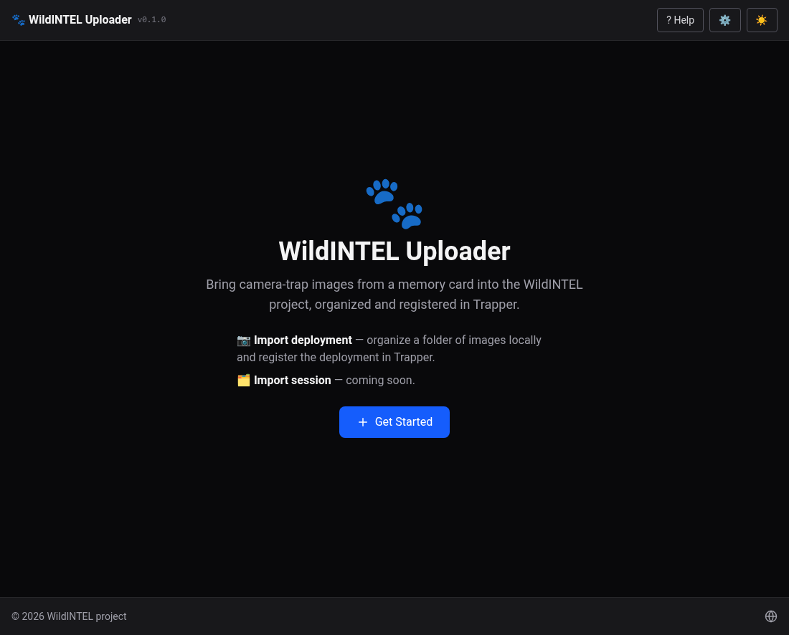

1. Open the app. The welcome screen says what it does; press **Get Started**.
2. Press **⚙️ Settings** (top right) and fill in the **Trapper** server, username and password —
   see [Settings](#4-settings). You can test them right there. Also fill in who owns the images
   (Preprocessing › Authorship) if you are going to import some.
3. Back on the menu, choose what you want to do:

| Task | What it's for |
|---|---|
| 📷 **Import deployment** | Check one folder of images and organize it in the collections folder. |
| 🗂️ **Import session** | The same for a folder holding several deployments, one subfolder each. |
| ☁️ **Upload deployment to Trapper** | Send deployments already kept locally to Trapper. |
| 🔄 **Sync local collections** | Bring the collections folder up to date with what Trapper already has. |
| 📑 **Reports** | The reports that the checks and the import leave — [look at them again, download them](#9-reports). |
| 📦 *Upload session to Trapper* | Coming soon. |

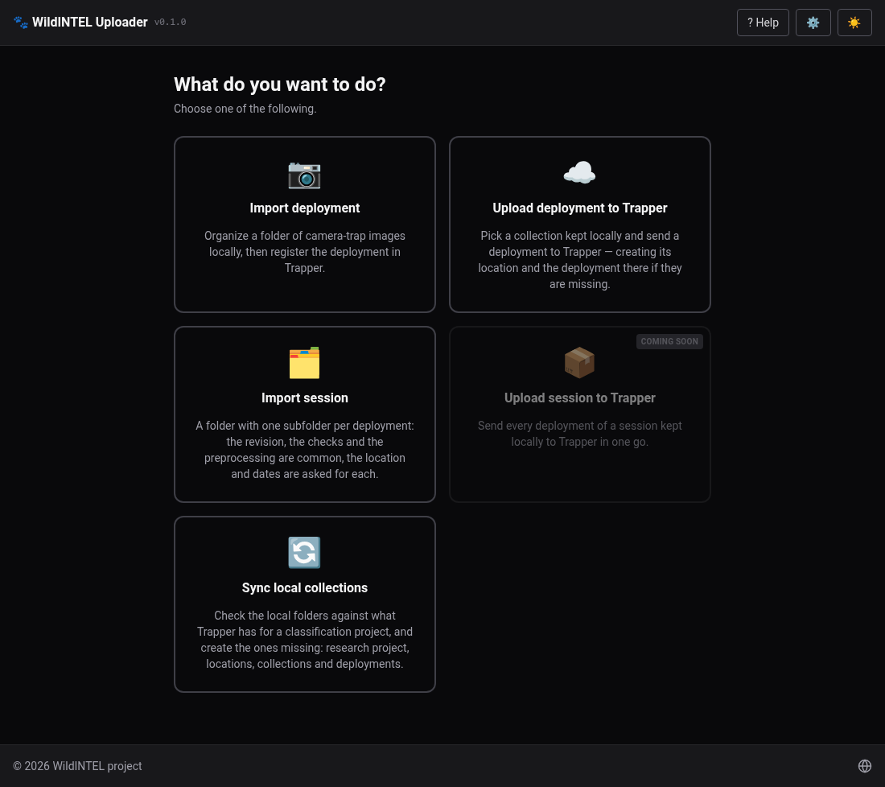

The usual order is **Import** (or **Import session**) first, then **Upload**. *Sync* is for when
Trapper already holds deployments that this computer's collections folder doesn't know about.

The title in the top bar takes you back to the welcome screen at any time; **? Help** opens this
documentation, and the sun/moon button switches between dark and light.

If the app was closed in the middle of an import, the first thing you see is the list of
**unfinished runs** — see [Unfinished runs](#unfinished-runs).

## 3. How the app works

### Deployments, revisions and collections

A **deployment** is one camera at one **location**, between the day it was set up and the day it
was collected. A location is visited again and again, so each visit is a **revision** — the 1st,
the 2nd, the 3rd one. The app names everything after that:

| | Example | |
|---|---|---|
| Revision | `3` | |
| Location id | `DONA_01` | |
| **Deployment id** | `R0003-DONA_01` | `R` + the revision as four digits + `-` + the location id |
| **Collection** | `R0003` | all the deployments of one revision |
| Research project | `DONA` | the project they all belong to, by its acronym |

The deployment id is never typed: you give the revision and the location, and the app builds it.

### The collections folder

Imported deployments are kept in your **collections folder** until they are uploaded — by default
`Documents/wildintel-uploader/collections`:

```text
collections/
└── DONA/                                   ← research project
    ├── research_project.json
    ├── locations.json                      ← its locations, with timezone and coordinates
    └── R0003/                              ← collection (one revision)
        ├── collection.json
        ├── R0003_FileTimestampLog.csv      ← the start and end of each deployment
        └── R0003-DONA_01/                  ← deployment
            ├── R0003-DONA_01__20240904_1.JPEG …    the images
            ├── deployment.json             ← its details
            ├── images.json                 ← what is known of each image
            ├── preprocessing.json          ← what was done to each image
            ├── seal.json                   ← what was checked, tied to the content
            └── upload.json                 ← written once it has been uploaded
```

Your **source folder is never touched**: the images are copied, and the copy is what gets renamed,
resized and tagged.

!!! warning "Copy the images off the camera's memory card first"
    Point the app at a folder on your computer, not at the memory card. The app only *reads* the
    source folder, but working from the card is slow and risks losing files if it is removed
    half-way.

### The location owns the timezone

A camera's clock has no timezone of its own: its images say "13:10", and the same camera,
elsewhere, would say it too. So the **timezone** (and whether the cameras there **ignore summer
time**) belongs to the **location**, never to a deployment. They are asked for when a location is
added, and every deployment there is read in them. The details step says it, in bold, before you
fill anything in. A location without a timezone is reported — the app doesn't guess one.

### Unfinished runs

An import saves its progress as you go. If you close the app, or it fails, the next time you start
it the first screen lists the **unfinished runs** — the folder, the research project and when it
was started — each with **Resume** and **Discard**. Resuming takes you back to the step after the
folder was chosen. Passwords are never saved with a run.

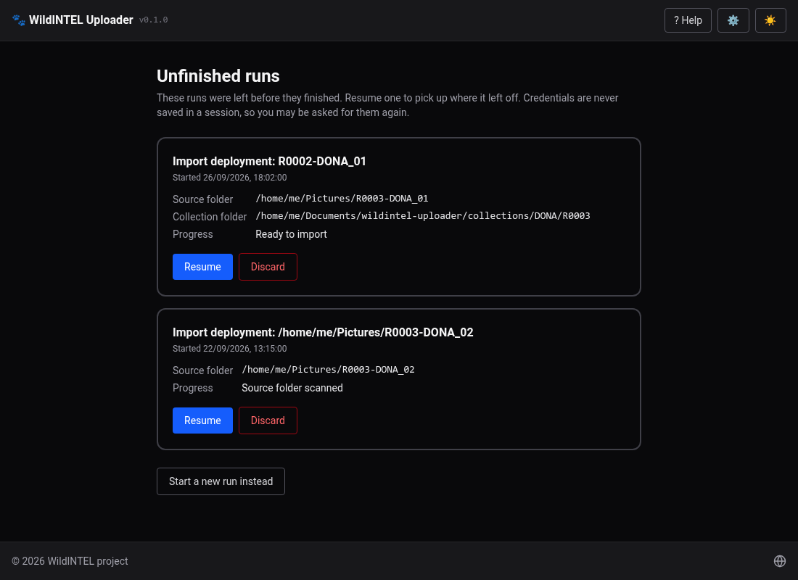

## 4. Settings

Press **⚙️ Settings**. It has its own sections on the left; one **Save** saves them all, and a red
dot marks a section with an invalid value.

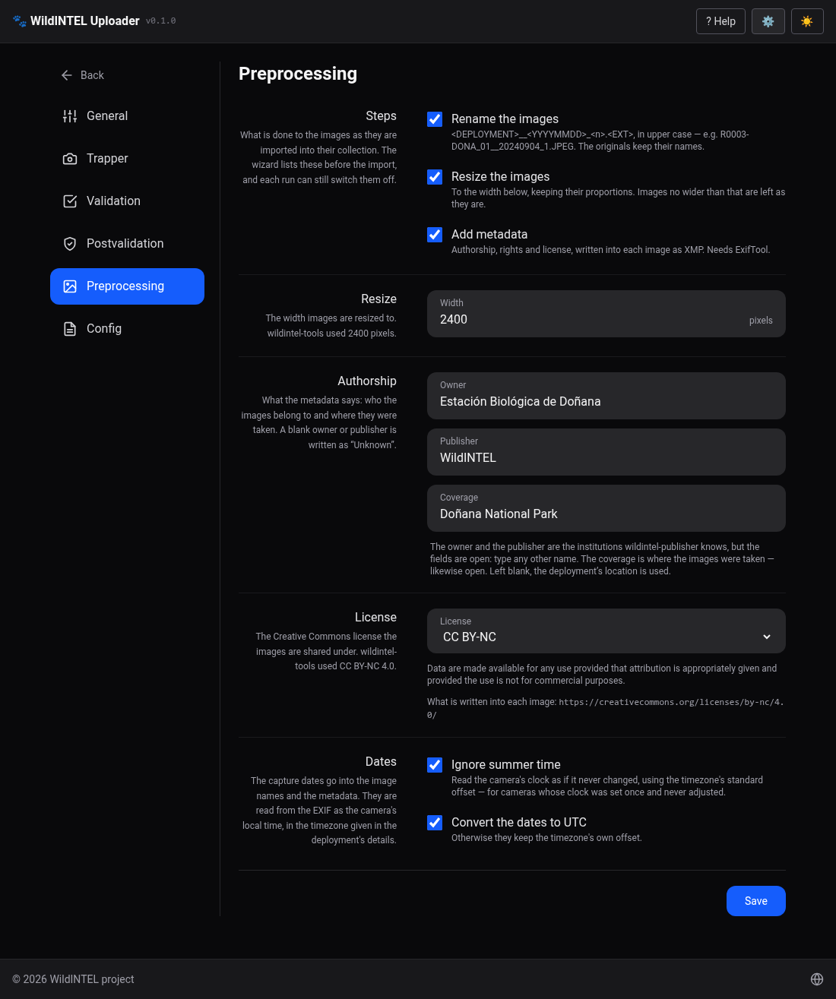

### General

- **Images folder** — where the collections folder lives. Blank uses
  `Documents/wildintel-uploader`; a path must be absolute (or start with `~`).
- **Workers** — how many images are validated and preprocessed at once. Up to the number of
  processors of your machine pays off; the default is that number, up to 4.
- **Log level** — how much the app logs (`ERROR`, `WARNING`, `INFO`, `DEBUG`). At `DEBUG` it logs
  every step.
- **Log file** — download it, or delete it. It rotates at 5 MB keeping the last 5. Attach it to any
  bug report.
- **Update** — looks for a newer version.

### Trapper

The server's **URL**, and the **username** (its email — Trapper's import form only accepts
that) and **password** of your account. **Test connection** reports the research projects it can
see. The password is saved in `settings.toml` but never sent back to your browser.

**Upload packages — Largest zip** is the size, in MB, of the zips an [upload](#7-upload-a-deployment-to-trapper) makes: a
deployment's images go up in zips of at most this size (500 by default, up to 5000), each with its own yaml.

### Validation

Which of the [folder checks](#step-2-validate) the wizard shows. Each is an entry with a switch;
turn off the ones you never want to see. They are all on by default.

### Postvalidation

Which of the [postvalidation checks](#step-5-postvalidation) the wizard shows, and what the ones
that take a value mean:

| Setting | Default | |
|---|---|---|
| Tolerance | 1 hour | Leeway around a deployment's start and end for the image dates. |
| Sequence gap | 60 s | What a *sequence* is: a new one starts when the gap to the previous image is at least this. |
| Compared with | median | What this revision is compared to: the **median** or **mean** of the earlier ones, the **last** one, or the **range** they span. |
| Previous revisions needed | 2 | With fewer, the statistical checks are skipped. |
| Number of images / sequences / length of sequences | 50 % each | How different a value can be and still count as similar. |

### Preprocessing

What a new import does to the images — the wizard lists it before importing, and a run can still
switch each step off.

- **Steps** — rename, resize, add metadata.
- **Resize width** — 2400 px by default; wider images are shrunk to it, narrower ones left alone.
- **Authorship** — **Owner**, **Publisher** and **Coverage** (where the images were taken; blank
  uses the deployment's location), written into each image. A blank owner or publisher is written
  as "Unknown".
- **License** — picked from a list: **CC0** (any use, no requirements), **CC BY** (any use with
  attribution) or **CC BY-NC** (with attribution, not for commercial purposes), the default. What is
  written into each image is the license's URL, shown beside each name.
- **Dates** — **Ignore summer time**, and **Convert the dates to UTC**.

### Config

The settings are saved in a file, `settings.toml`. Here you can keep **several**: **+** adds one
with the default values, and choosing one makes it the active one — handy to switch between two
Trapper servers (a test one and the real one) or two sets of authorship. Each can be downloaded,
and its folder opened.

## 5. Import a deployment

Press **📷 Import deployment**. A wizard of seven steps — the bar at the top shows where you are;
**Back** and **Next** move between them.

### Step 1 — Folder

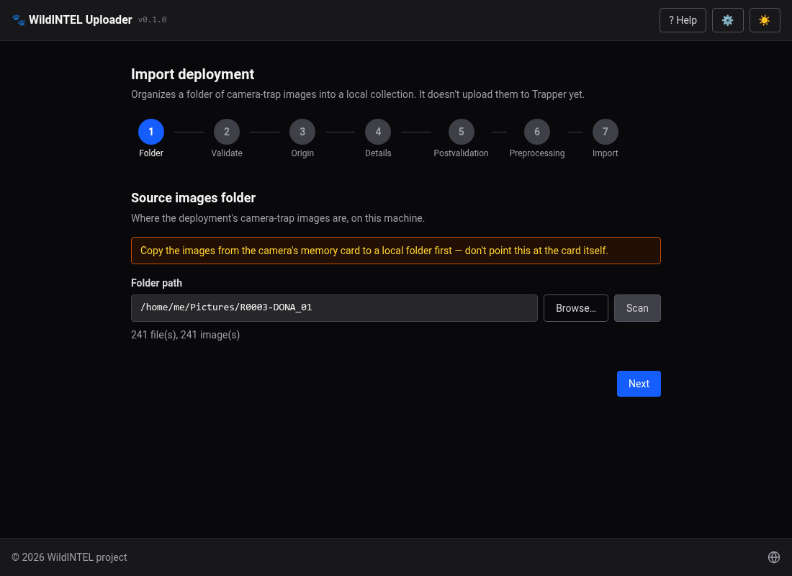

Press **Browse…** and choose the folder with the deployment's images (or type its path), then
**Scan**. The scan only **counts**: how many files there are and how many of them are images (by
their extension) — *241 file(s), 241 image(s)* — with a warning if the folder is empty or has no
images. It doesn't open them, which is why it is instant however many there are: reading the
images is what the next steps are for. The dates and the camera model are read later, when the
[details](#step-4-details) are asked for.

### Step 2 — Validate

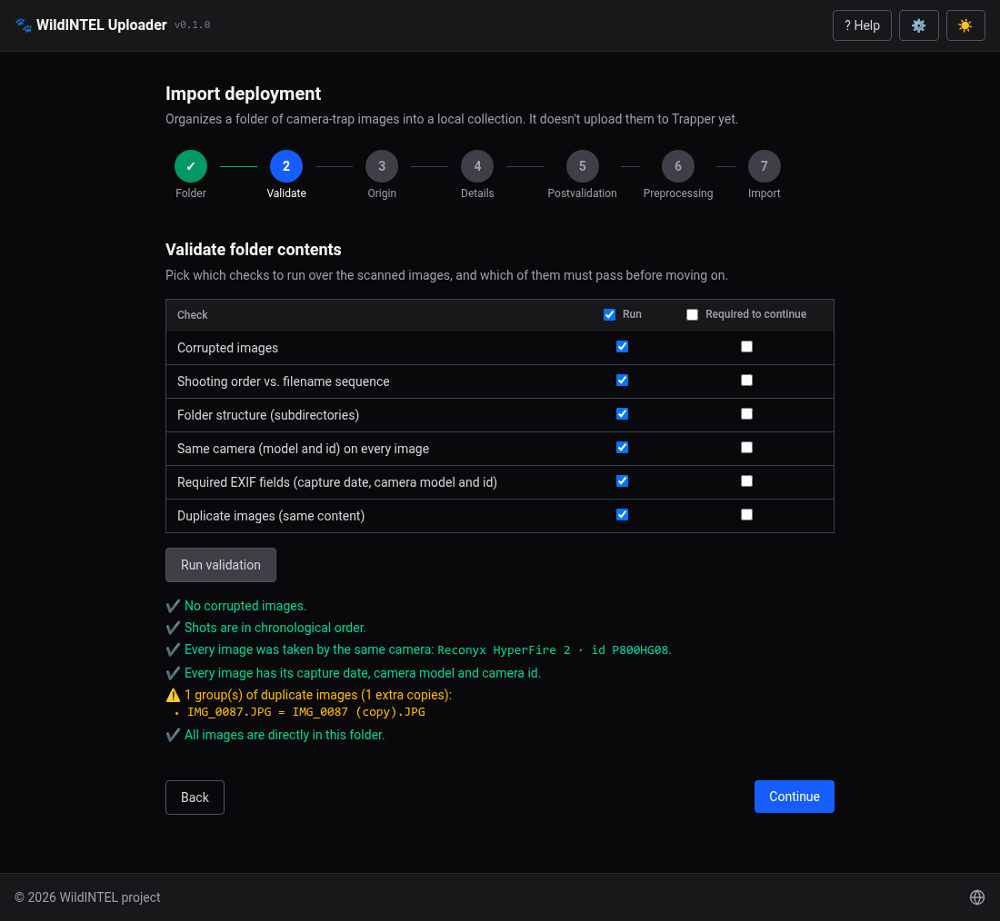

Checks over the images alone, before anything is known about the deployment:

| Check | Looks for |
|---|---|
| Corrupted images | Files that aren't readable images. |
| Shooting order vs. filename sequence | Images whose order by name differs from their order by time. |
| Folder structure | Subfolders inside the deployment's folder. |
| Same camera | More than one camera model or id among the images. |
| Required EXIF fields | Images missing the capture date, camera model or id. |
| Duplicate images | Files with the same content. |

The step is a small dashboard. At the top, what is being validated, **when it was last run**, the
downloads of its [report](#9-reports) and the **Run validation** button. Once it has run, four figures
sum it up: the **valid images**, the **images with issues**, the **tests executed** and the **tests
with errors**.

Under them, the **tests**. For each you choose whether to **run** it, and whether it is
**required**: a required check that doesn't pass stops you from going on. The *all* boxes at the top
of each column do it for the whole table. The first column shows a test running and then how it
ended — ✔ passed, ⚠ failed, ✘ failed and required —, and the last ones say how many images failed it.

Open a test that failed (the **›** at its end) to see **which images failed it**: as pictures, each
with what is wrong with it (*No date*, *Duplicate*, *Out of order*…) and when it was taken, or as a
list. You can **search by file name**, filter by the kind of error, sort by name or by date, and go
through the pages; **View details** opens the image bigger with everything the report says of it — what
failed and what passed. A test of the whole folder (the structure, or the camera) has no pictures: it
says what it found.

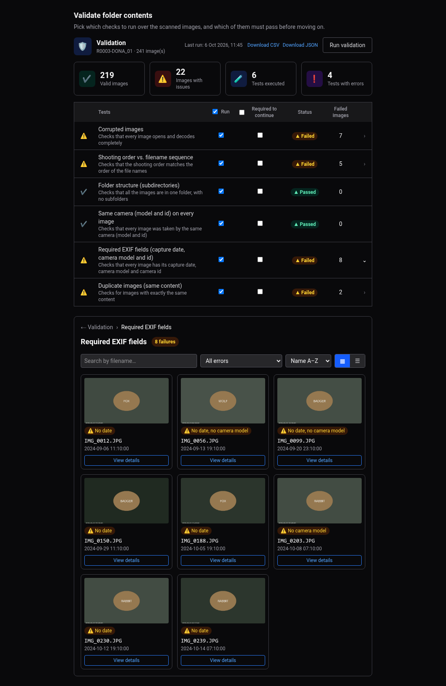

Reading the camera's model and id uses ExifTool, because the serial number of a camera trap lives
in the manufacturer's own metadata. Without it the app falls back to the standard EXIF tags,
which are less complete — it says which it used.

### Step 3 — Origin

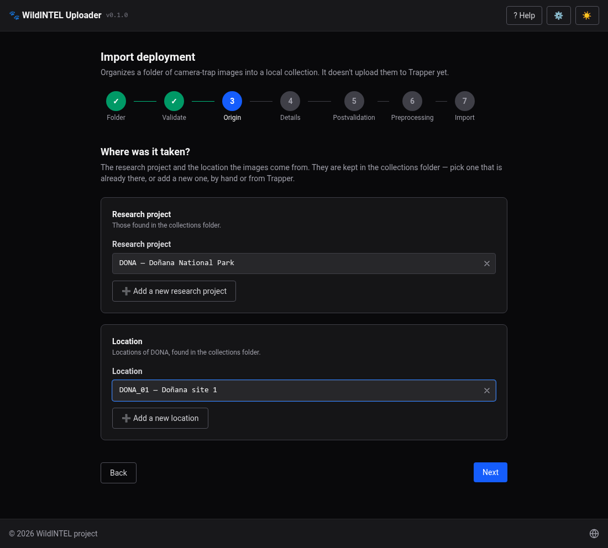

*Where was it taken?* The **research project** and the **location** the images come from. They are
kept in the collections folder; pick one already there, or add a new one:

- **By hand** — the project's name and acronym (which names its folder); a location's id, name,
  latitude, longitude, coordinate uncertainty, **timezone** and whether its cameras ignore summer
  time.
- **From Trapper** — pick the project, or its locations, from your Trapper account and they are
  copied here, with their coordinates and timezone. The app connects by itself with the account
  saved in the settings — it never asks for the credentials again; if there isn't one, it says so.

### Step 4 — Details

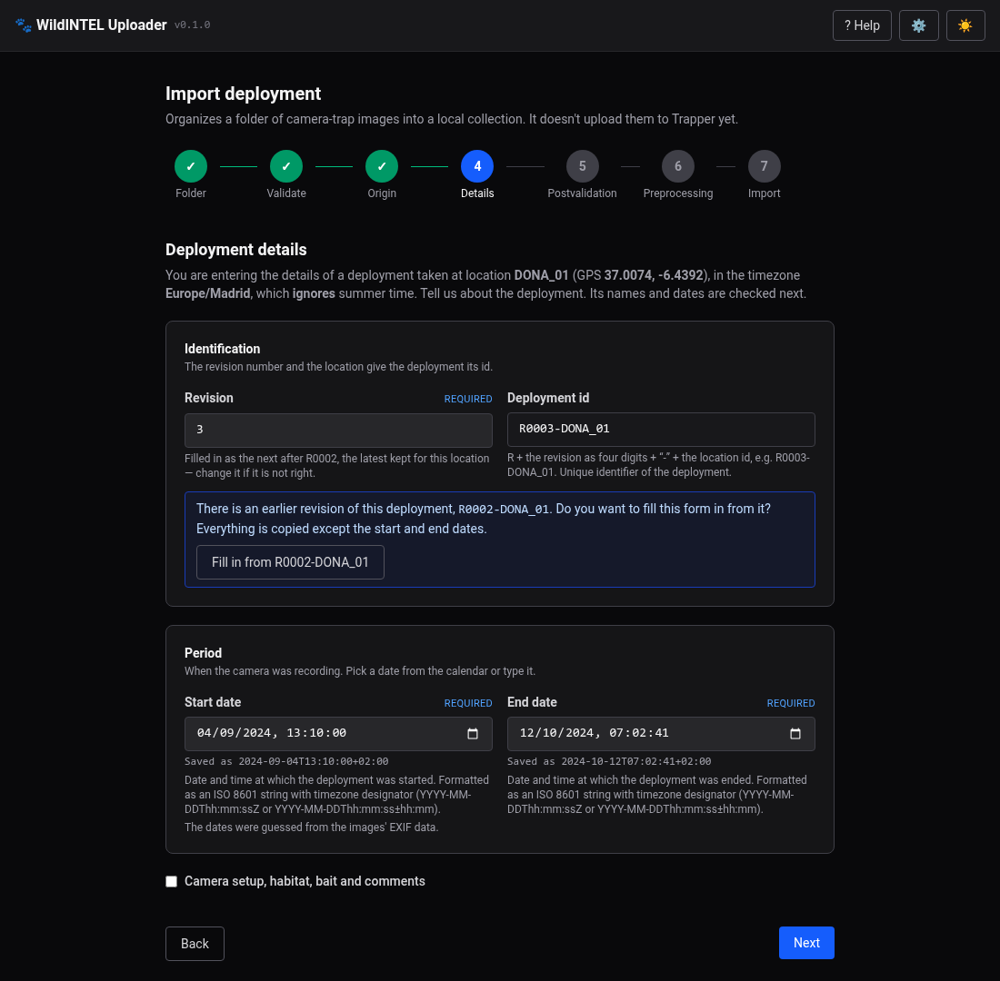

The deployment's own data. **Revision** starts as the next one expected for that location — one
more than the highest kept — and says so; change it if needed, and the **Deployment id** is built.

If an earlier revision of this deployment is kept, the app offers to **fill in the form from it**:
everything is copied except the start and end dates. If the deployment **already exists** in the
collections folder you are told, and the import would be refused as it would mix two sets of
images: choose another revision or location, or move that folder away.

The rest of the form follows [Camtrap DP](https://camtrap-dp.tdwg.org)'s deployment table — the
same fields as Trapper's own deployment form. Only the **start and end dates** are required (and
are read from the images' EXIF as this step opens — the earliest and the latest capture date —, along
with the camera model and id, when every image has the same); everything else is optional, and can be completed later in
Trapper. *Show all fields* reveals the whole list.

| Card | Fields |
|---|---|
| **Period** | Start and end, as the camera's local time. |
| **Camera** | Camera id and model, delay between triggers, height *or* depth (not both), tilt, heading, detection distance, timestamp issues. |
| **Site** | Set up by, feature type (road, trail, burrow, water source…), habitat, bait used. |
| **Grouping and notes** | Deployment groups, tags, comments. |

The form is validated as you type, in the browser and again in the server: dates in order,
latitude and longitude in range, tilt between −90 and 90, heading between 0 and 360.

!!! info "A timestamp log can set the dates"
    If the collection has a `<COLLECTION>_FileTimestampLog.csv` — the file wildintel-tools asks
    for beside a collection's deployments — the dates are taken from it instead of from the
    images, and this step says so. In an *Import session*, the same applies to each deployment
    that has a row in it.

When you press **Next**, the deployment is added to the collection's timestamp log.

### Step 5 — Postvalidation

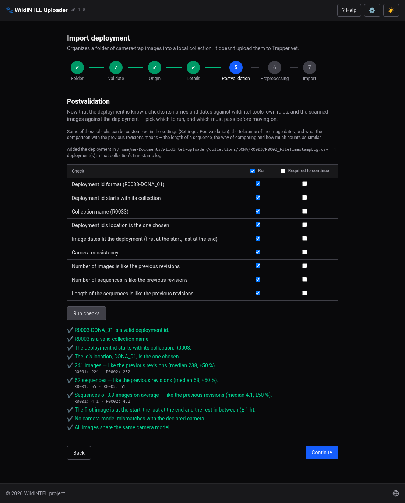

Now that you know when, how and where the images were taken, new validation tests are run: the deployment's names and dates, and the images against it:

| Check | Looks for |
|---|---|
| Deployment id format | `R0033-DONA_01`. |
| Deployment id starts with its collection | `R0033-…` belongs to `R0033`. |
| Collection name | `R0033`. |
| The id's location is the one chosen | The location in the id is the one from step 3. |
| Image dates fit the deployment | The first image at the start, the last at the end, within the tolerance. |
| Camera consistency | The camera in the images is the one in the details. |
| Number of images | Like the previous revisions of the location. |
| Number of sequences | Like the previous revisions of the location. |
| Length of the sequences | Like the previous revisions of the location. |

The last three are **statistical**: a location is visited again and again, so what earlier
revisions looked like says what this one should — about as many photos, about as many sequences,
as long. A camera that fired non-stop, or died early, stands out, and is worth a look *before* it
is uploaded. They need at least the *previous revisions needed* of the settings, or they are
skipped; what a sequence is, what "similar" means and what it is compared to are the
[Postvalidation settings](#postvalidation).

This step has the same dashboard as the validation (with a **Run checks** button): when it was last run, the figures, the table of checks with their status, and — opened from a check — the images that failed it (*Out of range*, *Other camera*) as thumbnails. Each check can be run and required, and the [report](#9-reports) downloads.

### Step 6 — Preprocessing

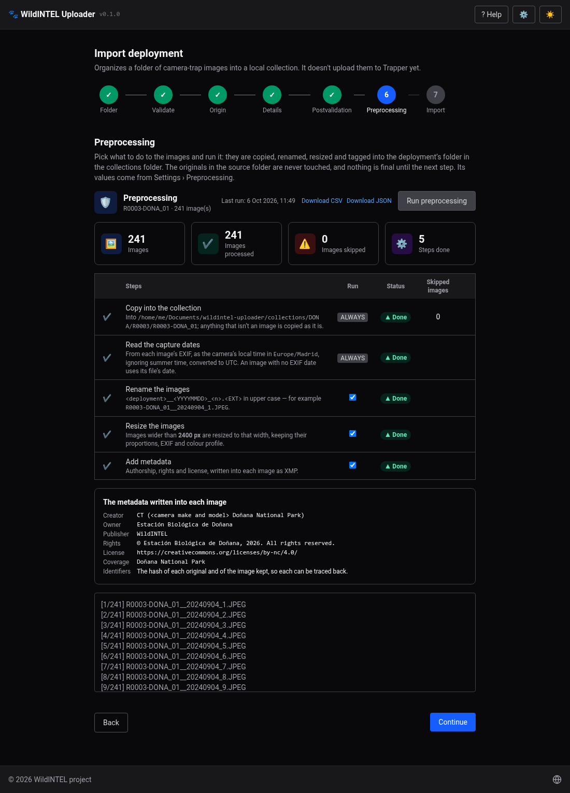

This step **does** the preprocessing, with the same dashboard as the validation: choose what to do to the images, press
**Run preprocessing**, and read the result — the images processed and skipped, a status for each step and, opened from the
**›**, the skipped images as thumbnails. The images go into the deployment's folder in the collections folder; the originals
are never touched. Nothing is final yet: you can go back, change something and run it again — the folder is simply redone —
and you can't go on until it has run.

1. **Copy into the collection** — always. Anything that isn't an image is copied as it is.
2. **Read the capture dates** — always. From each image's EXIF, as the camera's local time in the
   location's timezone — ignoring summer time and converting to UTC, as the settings say. An image
   with no EXIF date uses its file's date.
3. **Rename the images** — `<DEPLOYMENT>__<YYYYMMDD>_<n>.<EXT>` in upper case, `.jpg` becoming
   `.jpeg`, e.g. `R0003-DONA_01__20240904_1.JPEG`; *n* is the image's place in file-name order.
4. **Resize the images** — to the width of the settings, keeping proportions, EXIF and colour
   profile. Unlike wildintel-tools, the resized image is the one that is kept.
5. **Add metadata** — authorship, rights and license, written into each image as XMP with
   ExifTool: *Creator*, *Owner*, *Publisher*, *Rights*, *License*, *Coverage* and the hash of the
   original and of the image kept, so each can be traced back. It is switched off, with the reason
   given, if ExifTool isn't available. Check the owner and publisher in the settings first: if
   they're blank, the step says so.

Each optional step can be switched off for this run (its checkbox). Its values come from the
[Preprocessing settings](#preprocessing). The [report](#9-reports) says what was done to each image.

### Step 7 — Import

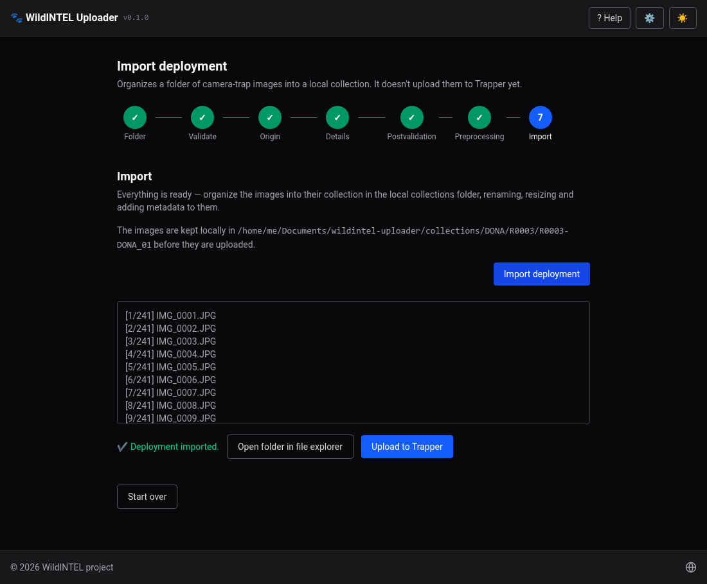

The images are ready, so this step **consolidates** the deployment: press **Import deployment** and its
`deployment.json` is written and the deployment is **sealed**. From then on it can't be modified — the app notices if an image
or its details change — and it can be uploaded.

A good import says where the deployment was kept, and offers:

- **Open folder in file explorer**.
- **Upload to Trapper** — straight to [the upload page](#7-upload-a-deployment-to-trapper) with the
  research project and the collection already chosen.
- **Start over**.

#### What gets written next to the images

| File | Content |
|---|---|
| `deployment.json` | The details of step 4. |
| `images.json` | Per image: its name (and the original, if renamed), when it was taken — the camera's wall clock and the instant —, the camera, size and pixels, and hashes. It lets later checks, and the statistics of the next revisions, work without opening the images again. |
| `preprocessing.json` | What was done to each image, with its hashes: `source_hash` of the original, `hash` of the image kept, `final_hash` of the file with its metadata. |
| `seal.json` | Which validation and postvalidation checks the deployment and each image passed, and the hash of everything. |

The **seal** protects against changes by mistake: if an image or `deployment.json` is changed
after the import, the seal no longer matches, and the app can tell. It is not a signature —
whoever edits the files on purpose could seal them again.

## 6. Import a session

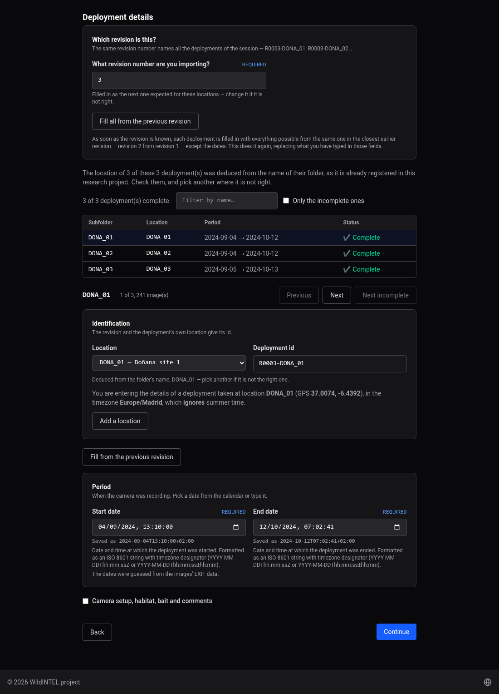

Press **🗂️ Import session**. A **session** is a folder with **one subfolder per deployment** — the
usual way a field trip's images come home. The revision, the checks and the preprocessing are the
same for all; the location, dates and camera are asked for each deployment.

The steps are those of [Import a deployment](#5-import-a-deployment), with the differences below.

1. **Session** — choose the folder and **Scan**. Its subfolders are listed, each with its images
   and warnings; tick the ones to import.
2. **Validate** — the checks run over every chosen deployment, and the result is shown for each.
3. **Origin** — one research project for the whole session.
4. **Details** — first the **revision**, common to the session, which names all the deployments
   (`R0003-DONA_01`, `R0003-DONA_02`…). Then each deployment's own details: a **list** of them,
   with how many are complete (*"12 of 40 deployments complete"*), a *filter by name*, and
   **Previous**, **Next** and **Next incomplete** to move between them. Each deployment has its
   own location — you pick it or add it — and no two can share one. **Fill in from the previous
   revision** works on one deployment or on all that have one.
5. **Postvalidation** — for each deployment.
6. **Preprocessing** — one list for all.
7. **Import** — each deployment in turn, with its own result. If some fail, importing again
   resumes with the ones that are still pending.

When it ends, **Upload to Trapper** goes to the upload page with the collection chosen.

If the session folder has a `<COLLECTION>_FileTimestampLog.csv`, the dates of each deployment with
a row in it come from there, and the details say so.

## 7. Upload a deployment to Trapper

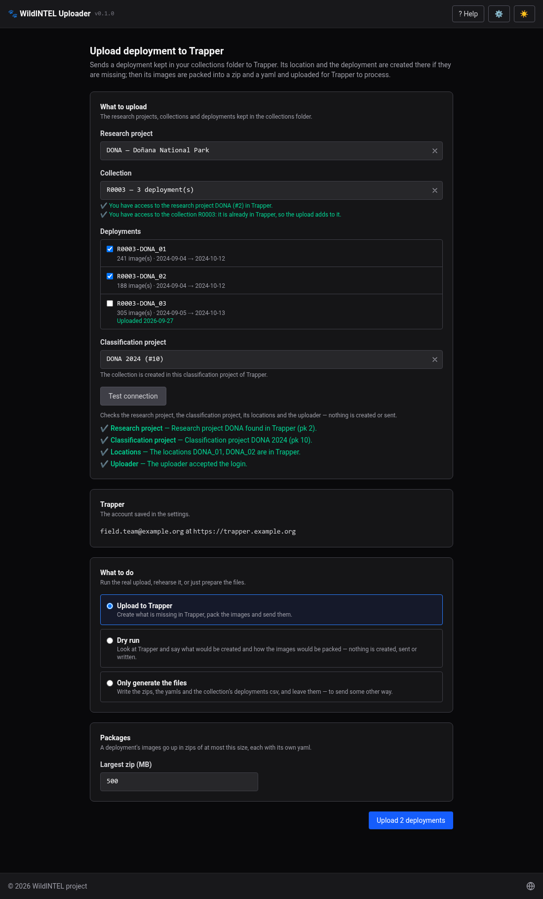

Press **☁️ Upload deployment to Trapper**. It sends deployments kept in the collections folder.
For each one it does what wildintel-tools did in three commands:

1. creates the **location** in Trapper, from the deployment's coordinates, if the research project
   doesn't have it, and the **deployment**, from its details;
2. packs the images in **zips** and the **yaml** that describes them — what was recorded when —,
   splitting in several parts when a zip would be larger than the limit;
3. uploads each zip and its yaml, and tells Trapper to **process them into a collection**.

The deployment must have been imported with the wizard — the yaml needs the dates its
`preprocessing.json` records. One that wasn't says "Not preprocessed — import it again through the
wizard before uploading it", and can't be ticked.

### What to upload

A note above says which Trapper account is used: the one saved in the settings.

1. **Research project** — those kept in the collections folder.
2. **Collection** — and under it a table of its deployments: how many images, its dates, and the day it was
   uploaded, if it was (from its `upload.json`, a local note). The ones left to send start ticked; **Select all**, **Select the not uploaded**
   and **Select none**, or the box in the table's header, change the choice. As soon as the research project and the
   collection are chosen, a message says whether **the account saved in the settings has access** to both in Trapper (and whether the
   collection is already there, so the upload adds to it, or the upload creates it).
3. **Classification project** — the collection is created in one of Trapper's classification
   projects for the research project: pick it (or, if there is only one, it is used). Without a
   Trapper account, type its pk.
4. **Test connection** — appears once the classification project is chosen. It checks, changing nothing, that the account reaches the research
   project, the classification project, its locations (and which of the deployments' own would be created) and the uploader's login, each
   reported on its own. Do it before a big upload.

### What to do

| Mode | What it does |
|---|---|
| **Upload** | The real thing. |
| **Dry run** | Looks at Trapper and says what would be created and how the images would be packed. Nothing is created, sent or written. |
| **Only generate the files** | Writes the zips, the yamls and the collection's `_deployments.csv` and leaves them, to send some other way. Needs no account if the research project was filled in from Trapper. |

The size of the zips is a setting: [Settings › Trapper](#trapper).

Press the button — *Upload 2 deployments*. Each deployment gets a card (below) with the steps it goes
through (*connect*, *classification*, *location*, *deployment*, *package*, *csv*, *upload*,
*process*, *wait*) each marked as running, done or skipped, a bar while a file goes up, and the
outcome. When one fails, the others go on, and the summary says so: *"2 deployment(s) uploaded, 1
failed."* **Upload more** starts over.

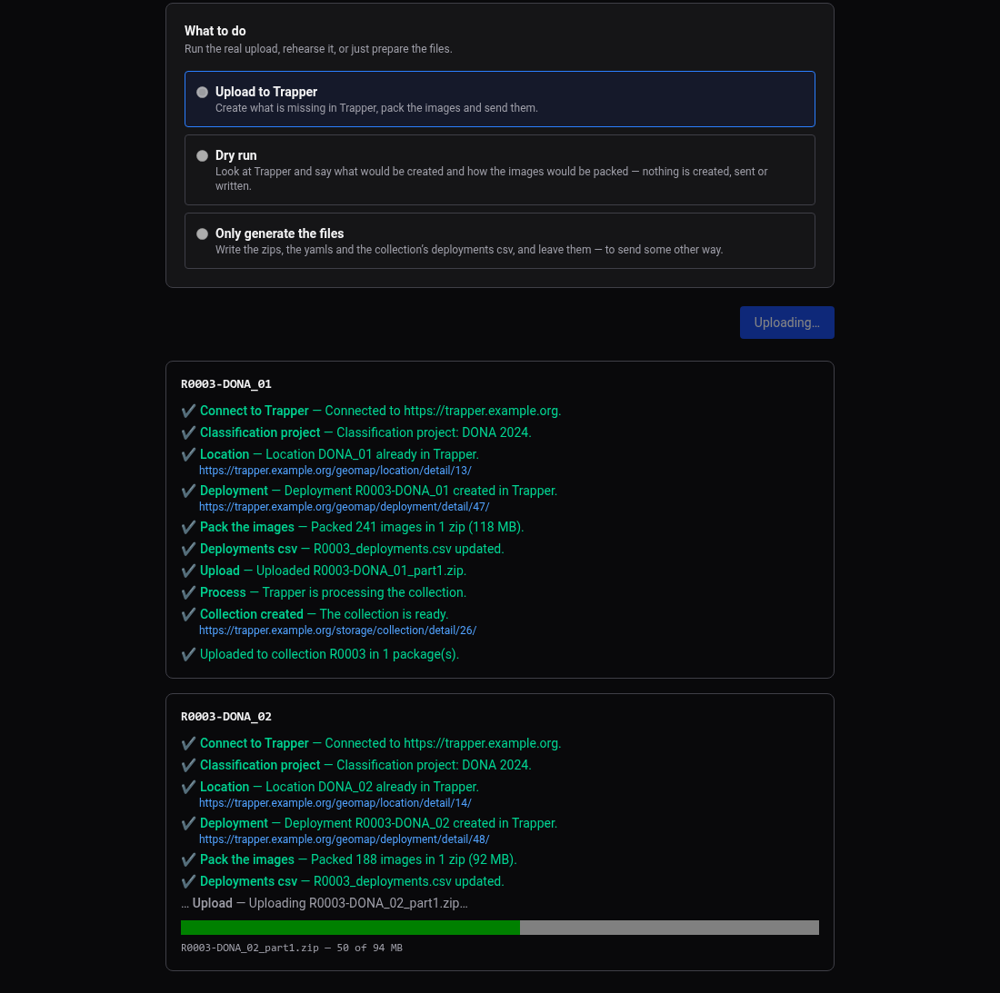

The zips and yamls are written under `<images folder>/packages/<research project>/`. A deployment
that was uploaded gets an `upload.json`, which is what the list uses to say so.

## 8. Sync local collections

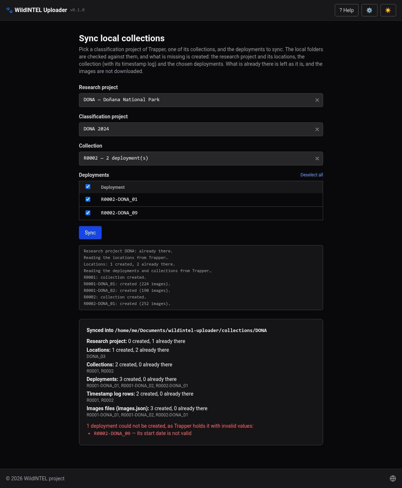

Press **🔄 Sync local collections**. Use it when Trapper already has deployments that the
collections folder doesn't — say, imported years ago, or from another computer — so that the
statistics of the *next* revisions can compare with them, and the folder reflects what Trapper
holds.

1. Pick a **research project**, then one of its **classification projects**.
2. Pick a **collection** (those of the classification project whose name starts with `R`) and,
   under it, the **deployments** to sync — with *Select all*.
3. Press **Sync**.

What is missing is created, one deployment at a time, and a live log says what is happening:

- the research project (`research_project.json`) and its `locations.json`;
- the collection (with its `collection.json` and `<collection>_FileTimestampLog.csv`);
- each chosen deployment's `deployment.json`, in the collection its id starts with, and an
  `images.json` made from what Trapper holds for its images (names, when they were taken,
  observations).

What is already in the folder is **left as it is**, whatever Trapper says. **Nothing is changed in
Trapper**, and **no image is downloaded** — so there is no `preprocessing.json`, and the size,
pixels and hashes are missing from `images.json`, which is marked `"source": "trapper"`. A
deployment synced this way is *read-only* for the app: what Trapper holds isn't modified here.

The result lists, per kind, what was created and what was already there, the deployments no
collection of the classification project claims, and any that Trapper holds in a way that isn't a
valid deployment — with the reason — and were left out.

## 9. Reports

Every **validation**, **postvalidation** and **preprocessing** leaves a **report** of what it checked and did,
image by image. The step shows it right below its results — the same file you can download, so what you see is
what is kept:

- the **checks**, with how many images passed and how many failed each;
- the **images that failed**, with the check and why — *IMG_0087.JPG · Duplicate images · same content as IMG_0087 (copy).JPG* —
  that can be narrowed to one check, and are shown 100 at a time;
- **Download CSV** — a row per image and check, to open in a spreadsheet — and **Download JSON**, with everything: when it
  was made, the folder, the parameters it was run with and every entry.

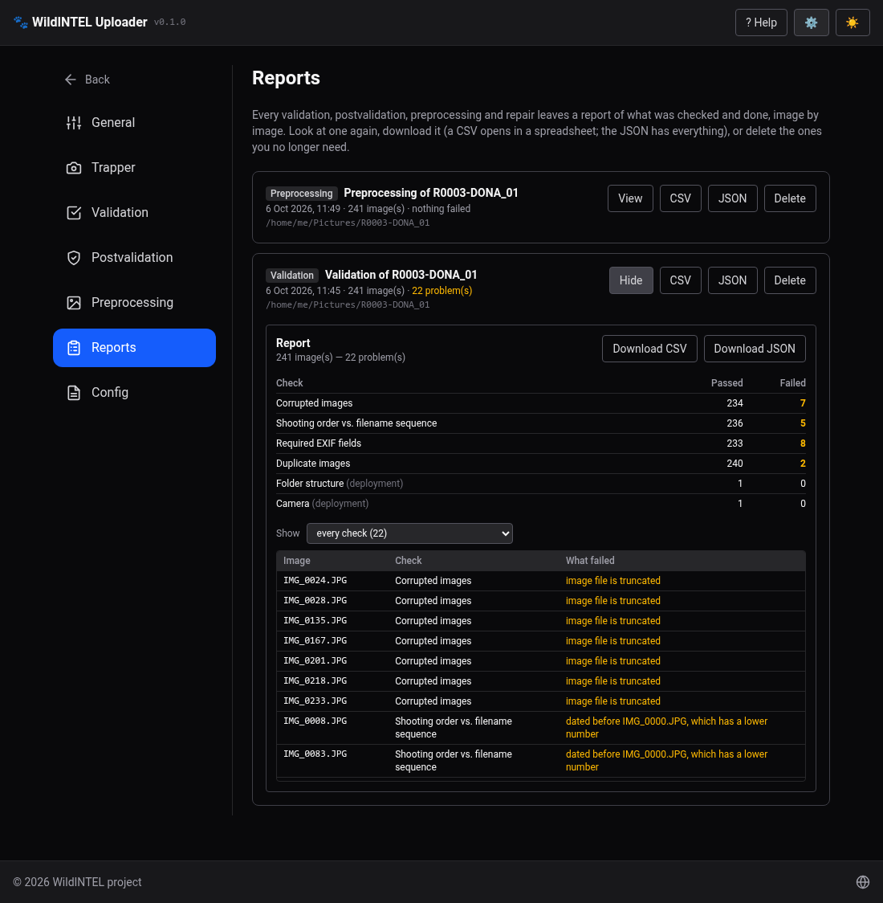

What each report holds:

| Report | An entry for | Says |
|---|---|---|
| **Validation** | each image and check — corrupted, shooting order, EXIF fields, duplicates —, and the folder for the structure and camera checks | The ones that passed too, so the report says what was checked, not only what failed. |
| **Postvalidation** | the deployment for the naming and statistical checks, and each image for its date and camera | Why a check failed — *241 images — like the previous revisions (median 238, ±50 %)*. |
| **Preprocessing** | each image | What was done — *IMG_0001.JPG → R0003-DONA_01__20240904_1.JPEG; date 2024-09-04T11:10:00+00:00 (exif); resized* — and the ones that were **skipped**, with the reason. |

The **📑 Reports** task of the menu lists all of them, newest first, with *View*, *CSV*, *JSON* and *Delete* (which
asks again). They are kept in the `reports` folder of the images folder until you delete them. A check you run twice
makes two reports.

## 10. Where the app keeps its files

| What | Where |
|---|---|
| Settings | `settings.toml` in the app's config folder: `~/.config/wildintel-uploader/` (Linux), `%APPDATA%\wildintel-uploader\` (Windows), `~/Library/Application Support/wildintel-uploader/` (macOS). More configs in `configs/` there. |
| Log | `logs/wildintel-uploader.log` next to it. |
| Collections | `Documents/wildintel-uploader/collections/` (or *Images folder* of the settings). |
| Packages to upload | `Documents/wildintel-uploader/packages/`. |
| Unfinished runs | `Documents/wildintel-uploader/sessions/`. |
| Reports | `Documents/wildintel-uploader/reports/` — one JSON file each. |

From a terminal, `wildintel-uploader config path` prints them — see the
[command-line manual](user-manual-cli.md#3-settings).

## 11. Troubleshooting

**"Backend not reachable — is the server running?"**
:   The red bar at the top. The window that started the app was closed, or it crashed. Start the app
    again, and look at the log (Settings › General) if it recurs.

**The browser doesn't open**
:   Open <http://127.0.0.1:8769> yourself. If that port was busy the app took the next free one:
    the window that started it says which (`Server on http://127.0.0.1:8770`).

**"Incorrect Trapper username or password"**
:   The username is the **email** of your account. Check it in Settings › Trapper and press
    **Test connection**.

**"Could not connect to the Trapper server"**
:   The URL is wrong — it needs `https://` and no trailing path — or the server is down or
    unreachable from your network.

**The metadata step is greyed out: "ExifTool is not installed"**
:   The downloadable app ships its own ExifTool. Running from the source code, install it
    (`sudo apt install libimage-exiftool-perl`, `brew install exiftool`) — or switch the step off.

**"This deployment already exists"**
:   A deployment with that id is already kept in the collections folder. Choose another revision or
    location, or move that folder away; importing would otherwise mix two sets of images.

**A location has no timezone**
:   Added by hand without one, or synced from a Trapper location that has none. Edit it in the
    *Origin* step; the app won't guess it.

**"Not preprocessed — import it again through the wizard"**
:   The deployment has no `preprocessing.json`: it was copied by hand, or synced from Trapper (which
    already has its images). Only deployments imported with the wizard can be uploaded.

**The upload says Trapper refuses the package**
:   Trapper checks the package's timezone and summer-time setting against the location's. If you
    changed them for the location in Trapper, they must be the same here — edit the location in the
    *Origin* step.

**The upload fails with "Trapper's uploader accepted the login but gave no session"**
:   The uploader's login answered without the session it should hand out. The message includes what
    Trapper said: send it to the Trapper administrator, or attach it to a bug report.

**Files ending in `_exiftool_tmp` in a deployment's folder**
:   ExifTool writes the metadata of each image through a temporary file; one it was interrupted in
    (the app stopped in the middle of an import) is left behind. The app removes them when the
    metadata step ends, or fails, but not if it was killed: delete them, and import again.

**An image was skipped**
:   The import lists skipped images with the reason, and goes on with the rest. A corrupted file is
    the usual cause; the *Corrupted images* validation finds them before importing.

**Reporting a problem**
:   Set the log level to `DEBUG` (Settings › General), repeat the steps and attach the log file
    to the report at
    [github.com/wildintelproject/wildintel-uploader/issues](https://github.com/wildintelproject/wildintel-uploader/issues).
